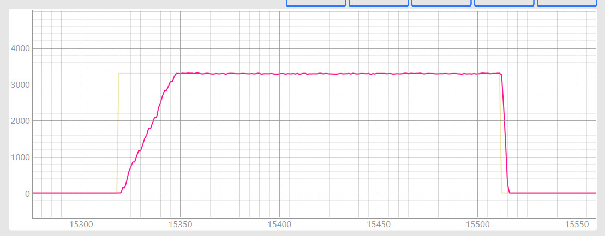
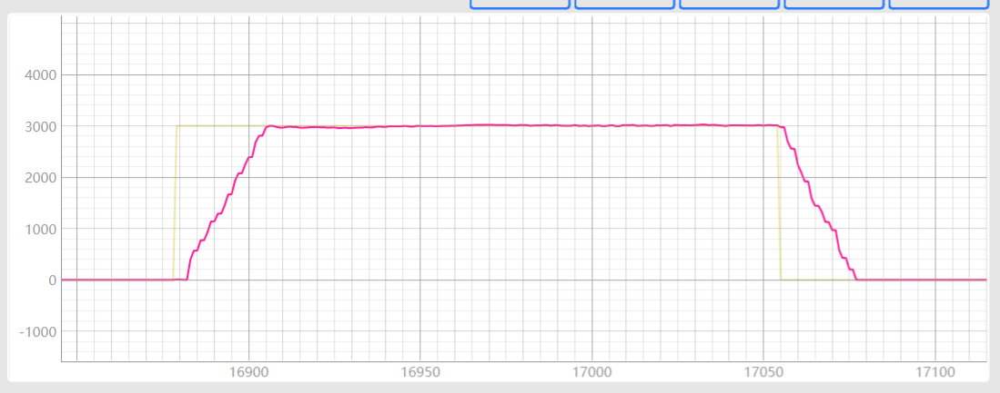

# 代码阅读

## 停止转速控制

1. 停止指令
2. 硬件故障
3. 写 EEPROM
4. 旋变故障
5. 过温故障
6. 欠压故障
7. 过压故障
8. 过流故障
9. 超速故障
10. 主副切换

## 停止驱动

1. 超速故障
2. 过流故障
3. 过压故障
4. 欠压故障
5. 过温故障
6. 旋变故障
7. 硬件故障

## 20240920 清水头试验

速度环：Kp = 0.6 其余不变（启动速度 1000），1000rpm、3300rpm（无超调），启动阶段有降转速情况

速度环：Kp = 0.6 其余不变（启动速度 4500），1000rpm（100+超调）、3300rpm（无超调），启动阶段有降转速情况

速度环：Kp = 0.6， Ki = 0.04 其余不变（启动速度 4500），1000rpm（200rpm 超调）、3300rpm（无超调），启动阶段有降转速情况

速度环：Kp = 1.2， Ki = 0.02 其余不变（启动速度 4500），1000rpm（无超调）、3300rpm（无超调），启动阶段无降转速情况，1000rpm 稳态误差增大

速度环：Kp = 1.2， Ki = 0.04 其余不变（启动速度 4500），1000rpm（100+超调）、3300rpm（无超调），启动阶段无降转速情况，1000rpm、3300 稳态误差增大

速度环：Kp = 1.2， Ki = 0.03 其余不变（启动速度 4500），1000rpm（无超调）、3300rpm（无超调），启动阶段无降转速情况，1000rpm、3300 稳态误差增大

速度环：Kp = 1.2， Ki = 0.01 其余不变（启动速度 4500），1000rpm（无超调）、3300rpm（无超调），启动阶段有降转速情况，1000rpm 稳态误差增大

速度环：Kp = 1， Ki = 0.02 其余不变（启动速度 4500），1000rpm（100+超调）、3300rpm（无超调），启动阶段有降转速情况，1000rpm 稳态误差增大

电流环：0.2，速度环：Kp = 1.2， Ki = 0.02 其余不变（启动速度 4500），1000rpm（启动结束阶段震荡）、3300rpm（100+超调），启动阶段无降转速情况

电流环：0.8，速度环：Kp = 1.2， Ki = 0.02 其余不变（启动速度 4500），1000rpm（无超调）、3300rpm（无超调），启动阶段无降转速情况，1000rpm 稳态误差 40+,前期转速跟不上

电流环：1，速度环：Kp = 1.2， Ki = 0.02 其余不变（启动速度 4500），1000rpm（无超调）、3300rpm（无超调），启动阶段无降转速情况，1000rpm 稳态误差 30+,前期转速跟不上

电流环：1.6，速度环：Kp = 1.2， Ki = 0.02 其余不变（启动速度 4500），1000rpm（无超调）、3300rpm（无超调），启动阶段无降转速情况，1000rpm 稳态误差 20+,前期转速跟不上

电流环：3.2，速度环：Kp = 1.2， Ki = 0.02 其余不变（启动速度 4500），1000rpm（无超调）、3300rpm（无超调）、2000rpm、4000rpm，启动阶段无降转速情况，1000rpm 稳态误差 20+,前期转速跟不上

