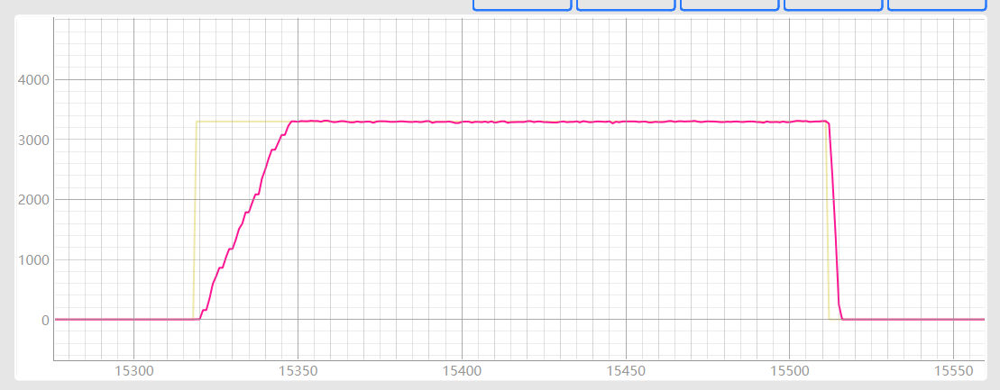
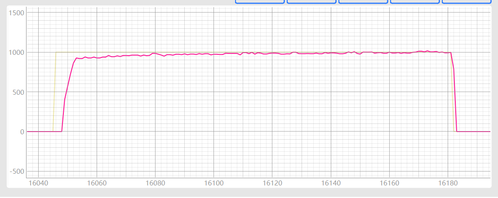
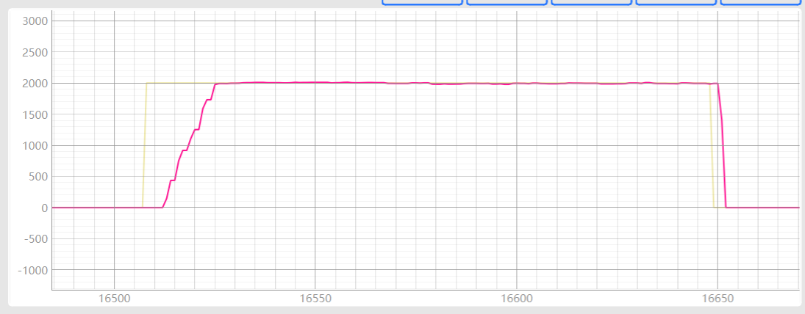
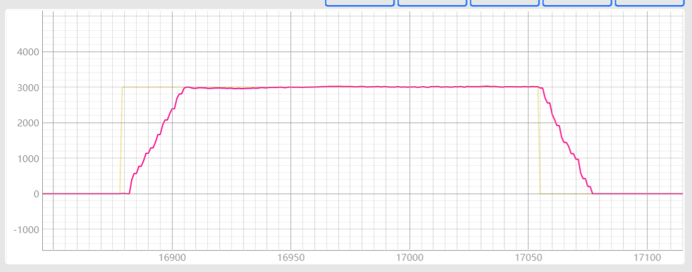
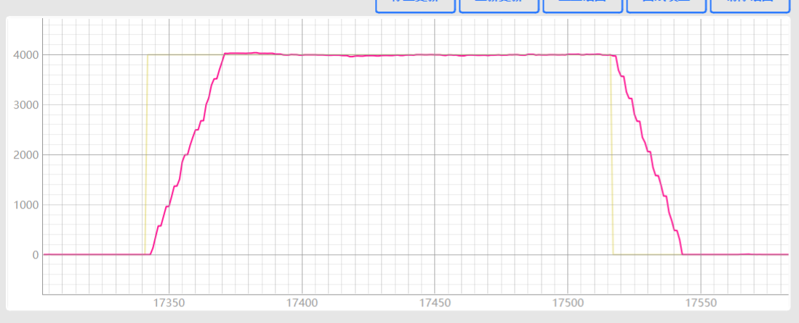

# 代码阅读

## 停止转速控制

1. 停止指令
2. 硬件故障
3. 写 EEPROM
4. 旋变故障
5. 过温故障
6. 欠压故障
7. 过压故障
8. 过流故障
9. 超速故障
10. 主副切换

## 停止驱动

1. 超速故障
2. 过流故障
3. 过压故障
4. 欠压故障
5. 过温故障
6. 旋变故障
7. 硬件故障

## 启动过程

1. 通讯接收启动指令
2. 设置运行标志，设置转速，设置 Isd_Set = 0、TorqueAngleA = 0， 设置转速运行标志为 1，设置位置控制标志位 0，设置停止转速控制为 0，设置转矩控制为 1
3. 转速控制（转速环）
4. 转矩控制（电流环）

+-----------------+
| speedControl() |
+-----------------+
|
v
+-----------------+
| 速度环调整 |
| |
| if (Veloover_Set - Velo_Set > Velo_PerAdd) |
| Velo_Set += Velo_PerAdd |
| else if (Velo_Set - Veloover_Set > Velo_PerAdd) |
| Velo_Set -= Velo_PerAdd |
| else |
| Velo_Set = Veloover_Set |
+-----------------+
|
v
+-----------------+
| PI 控制器周期处理|
| |
| pi_velo.ctrl_index++ |
| if (pi_velo.ctrl_index >= pi_velo.ctrl_period) |
| pi_velo.ctrl_index = 0 |
| pi_velo.pi_ref_reg = Velo_Set |
| pi_velo.pi_fdb_reg = Velo_Elec |
| pi_velo.calc(&pi_velo) |
+-----------------+
|
v
+-----------------+
| 电流斜率调整 |
| |
| if (IdSet >= 0) |
| if (Isd_Set - IdSet > Is_PerAdd) |
| IdSet += Is_PerAdd |
| else if (IdSet - Isd_Set > Is_DownPerAdd) |
| IdSet -= Is_DownPerAdd |
| else |
| IdSet = Isd_Set |
| else |
| if (Isd_Set - IdSet > Is_DownPerAdd) |
| IdSet += Is_DownPerAdd |
| else if (IdSet - Isd_Set > Is_PerAdd) |
| IdSet -= Is_PerAdd |
| else |
| IdSet = Isd_Set |
+-----------------+
|
v
+-----------------+
| 计算 Id_Set 和 Iq_Set |
| |
| Id_Set = -\_IQmpy(\_IQabs(pi_velo.pi_out_reg), \_IQsinPU(TorqueAngleA)) + IdSet |
| Iq_Set = -\_IQmpy(pi_velo.pi_out_reg, \_IQcosPU(TorqueAngleA)) |
| Isdq_Set2 = Iq_Set |
+-----------------+
|
v
+-----------------+
| 结束 |
+-----------------+

## 20240920 清水头试验

速度环：Kp = 0.6 其余不变（启动速度 1000），1000rpm、3300rpm（无超调），启动阶段有降转速情况

速度环：Kp = 0.6 其余不变（启动速度 4500），1000rpm（100+超调）、3300rpm（无超调），启动阶段有降转速情况

速度环：Kp = 0.6， Ki = 0.04 其余不变（启动速度 4500），1000rpm（200rpm 超调）、3300rpm（无超调），启动阶段有降转速情况

速度环：Kp = 1.2， Ki = 0.02 其余不变（启动速度 4500），1000rpm（无超调）、3300rpm（无超调），启动阶段无降转速情况，1000rpm 稳态误差增大

速度环：Kp = 1.2， Ki = 0.04 其余不变（启动速度 4500），1000rpm（100+超调）、3300rpm（无超调），启动阶段无降转速情况，1000rpm、3300 稳态误差增大

速度环：Kp = 1.2， Ki = 0.03 其余不变（启动速度 4500），1000rpm（无超调）、3300rpm（无超调），启动阶段无降转速情况，1000rpm、3300 稳态误差增大

速度环：Kp = 1.2， Ki = 0.01 其余不变（启动速度 4500），1000rpm（无超调）、3300rpm（无超调），启动阶段有降转速情况，1000rpm 稳态误差增大

速度环：Kp = 1， Ki = 0.02 其余不变（启动速度 4500），1000rpm（100+超调）、3300rpm（无超调），启动阶段有降转速情况，1000rpm 稳态误差增大

电流环：0.2，速度环：Kp = 1.2， Ki = 0.02 其余不变（启动速度 4500），1000rpm（启动结束阶段震荡）、3300rpm（100+超调），启动阶段无降转速情况

电流环：0.8，速度环：Kp = 1.2， Ki = 0.02 其余不变（启动速度 4500），1000rpm（无超调）、3300rpm（无超调），启动阶段无降转速情况，1000rpm 稳态误差 40+,前期转速跟不上

电流环：1，速度环：Kp = 1.2， Ki = 0.02 其余不变（启动速度 4500），1000rpm（无超调）、3300rpm（无超调），启动阶段无降转速情况，1000rpm 稳态误差 30+,前期转速跟不上

电流环：1.6，速度环：Kp = 1.2， Ki = 0.02 其余不变（启动速度 4500），1000rpm（无超调）、3300rpm（无超调），启动阶段无降转速情况，1000rpm 稳态误差 20+,前期转速跟不上

电流环：3.2，速度环：Kp = 1.2， Ki = 0.02 其余不变（启动速度 4500），1000rpm（无超调）、3300rpm（无超调）、2000rpm、4000rpm，启动阶段无降转速情况，1000rpm 稳态误差 20+,前期转速跟不上

